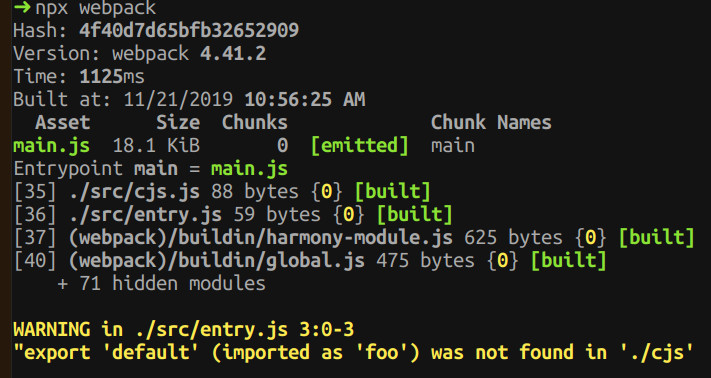
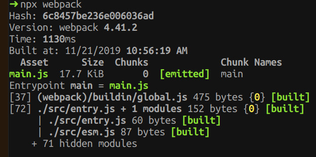

# Solution

https://github.com/babel/babel/issues/10745#issuecomment-557075583

# Instructions

Run `yarn`, then `yarn build`.

It should give you the following error:

Then in the `entry.js`, use the `./esm` import, instead of the `cjs` one.

Then it will compile fine:

